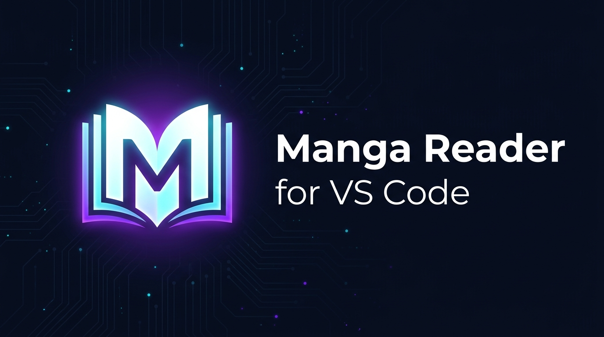
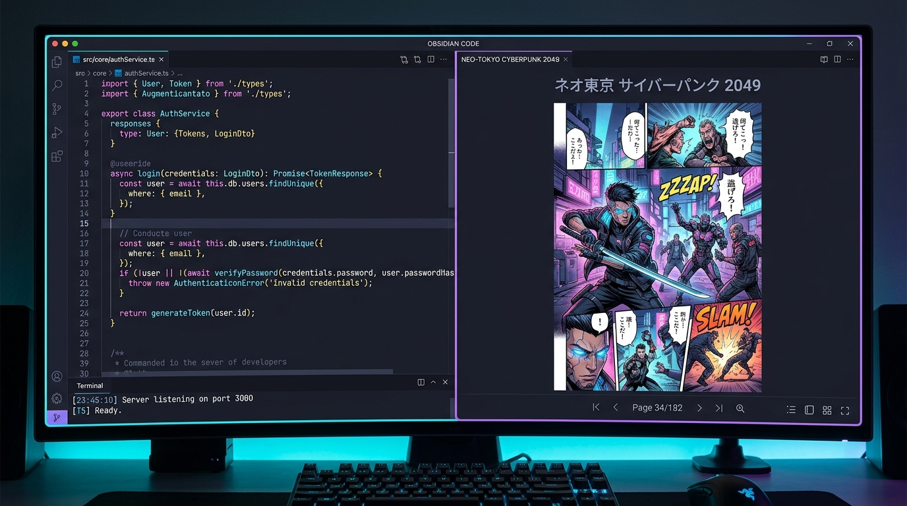
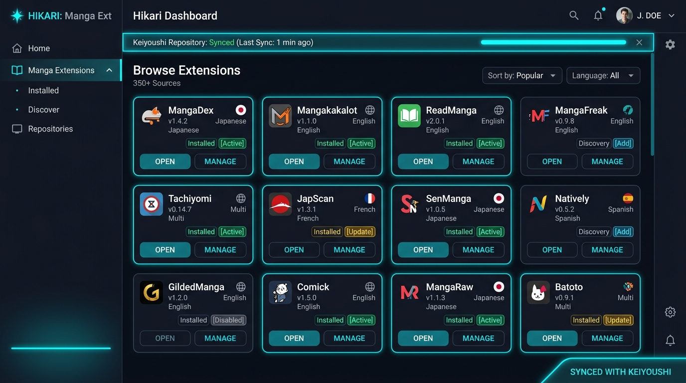

# MangaBar - Manga & Comic Reader for VS Code & Antigravity IDE



<p align="center">
  
  <a href="https://github.com/keiyoushi/extensions"></a>
  <a href="LICENSE"></a>
  
</p>

**MangaBar** is a dedicated, lightweight manga and comic reader engineered directly for code editors and IDEs. Read manga, manhwa, and webcomics seamlessly inside your workspace without switching windows, losing focus, or leaving your development workflow.

---

## Key Features



- **Dedicated Dual-Side Docking (Left or Right)**:
  - Dock MangaBar in either the Primary Activity Bar (left) or Secondary Side Bar (`auxiliarybar` on the right) with a single click. Keep your File Explorer open on the left and read manga on the right simultaneously.
- **Intuitive Reader Navigation Flow**:
  - Clicking the top-left backward arrow (`←`) in reader controls dismisses the menu and returns directly to the active manga page (instead of abruptly closing the reader).
  - A subtle, translucent floating exit button (35% idle opacity, 100% on hover) in the top-left corner allows you to smoothly exit back to Manga Details or Library.
- **Safe Clamped Ctrl-Zoom (50% - 400%)**:
  - Smooth `Ctrl + Mouse Wheel` and `Ctrl +/-/0` image zoom clamped between 0.5x and 4.0x.
  - Zero accidental triggers: calling `preventDefault()` ensures your IDE window/fonts never zoom accidentally.
  - Click-and-drag pan when zoomed in (`> 1.0x`); normal tap-to-turn works normally at 1.0x.
  - Automatic zoom reset on page turns and chapter changes, with a transient HUD pill.
- **Embedded Full Reader**:
  - Open any chapter or library view into a full-scale editor tab with hotkeys and smooth continuous or single-page reading.
- **Real-Time Clean Server Logging**:
  - Custom MangaBar ASCII launch banner and sanitized log output stream in the Output Channel.
- **Global Keyboard Shortcuts**:
  - Instant toggle (`Ctrl+Alt+M`) to show or dismiss MangaBar while coding.
- **Automated Lifecycle Management**:
  - Automatic background startup on activation, lock cleanup on restart, and graceful shutdown when exiting the IDE.
- **Remote or Custom Server Support**:
  - Connect to existing remote or local server instances (`mangabar.customServerUrl`) without downloading or running local binaries.
- **Automatic Storage Migration**:
  - Automatically migrates existing manga libraries and settings to `~/.mangabar`.
- **Keiyoushi Extension Catalog**:
  - Pre-configured source repositories for MangaDex, MangaKakalot, ComicK, and hundreds of sources.

---

## Keyboard Shortcuts

| Shortcut (Win / Linux) | Shortcut (macOS) | Command | Action |
|---|---|---|---|
| `Ctrl+Alt+M` | `Cmd+Alt+M` | `mangabar.toggleReader` | Toggle full reader editor tab (Open / Close) |
| `Ctrl+Alt+S` | `Cmd+Alt+S` | `mangabar.toggleSidebar` | Focus MangaBar sidebar companion in Activity Bar |
| `Escape` | `Escape` | Webview Close | Dismiss reader overlay when focused |

---

## Extension Repositories & Sources



MangaBar comes pre-configured with the official **Keiyoushi Extension Repository**:

```text
https://raw.githubusercontent.com/keiyoushi/extensions/repo/index.min.json
```

### Adding Extensions
1. Open the MangaBar sidebar or Full Reader (`Ctrl+Alt+M`).
2. Navigate to **Browse > Extensions**.
3. If prompted, confirm repository synchronization.
4. Click **Install** next to your preferred manga source.
5. Browse sources and add titles to your personal Library.

---

## Setup Options

### Option A: Automatic Local Server (Default)
When you first launch MangaBar without a custom server configured, the extension detects whether the server engine binary and Java runtime are installed. If missing, you will be prompted to download dependencies automatically:
- Automated installation to the local extension environment.
- Fully offline and isolated from your system Java installation.
- Default data directory initialized safely at `~/.mangabar`.

### Option B: Connect to Existing or Remote Server
If you already run a manga server on your machine, a home server, or a NAS:
1. Open VS Code Settings (`Ctrl+,` or `Cmd+,`).
2. Search for `mangabar.customServerUrl`.
3. Set your server endpoint (for example: `http://localhost:4567` or `http://192.168.1.100:4567`).
4. MangaBar will connect directly to your existing server without launching local binaries.

---

## Commands

| Command | Identifier | Description |
|---|---|---|
| **MangaBar: Toggle Side Bar Location** | `mangabar.toggleSideBarLocation` | Toggles MangaBar between Left and Right sidebars |
| **MangaBar: Toggle Full Reader** | `mangabar.toggleReader` | Toggles the reading panel (`Ctrl+Alt+M`) |
| **MangaBar: Open Full Reader** | `mangabar.openReader` | Opens the MangaBar WebUI in a main tab |
| **MangaBar: Toggle MangaBar Sidebar** | `mangabar.toggleSidebar` | Opens the MangaBar sidebar view (`Ctrl+Alt+S`) |
| **MangaBar: Start Server** | `mangabar.startServer` | Starts the local MangaBar background process |
| **MangaBar: Stop Server** | `mangabar.stopServer` | Gracefully terminates the background server |
| **MangaBar: Restart Server** | `mangabar.restartServer` | Restarts the local background process with lock clearance |
| **MangaBar: Reload View** | `mangabar.reloadView` | Reloads active webview frames |
| **MangaBar: Change Storage Location** | `mangabar.configureStorage` | Launches folder picker to relocate data path |
| **MangaBar: Open in External Browser** | `mangabar.openWebBrowser` | Opens active server URL in default system browser |

*(Legacy `mihon.*` command IDs are maintained as transparent forwarding aliases for backward compatibility).*

---

## Configuration Settings

| Setting | Default | Description |
|---|---|---|
| `mangabar.sideBarLocation` | `"left"` | Placement of MangaBar (`"left"` Activity Bar or `"right"` Secondary Side Bar) |
| `mangabar.customServerUrl` | `""` | Optional remote or existing server URL (e.g. `http://localhost:4567`) |
| `mangabar.serverPort` | `4567` | Default HTTP port (auto-increments if in use) |
| `mangabar.dataDirectory` | `./data` | Directory where MangaBar stores library, database, and settings |
| `mangabar.downloadDirectory` | `./data/downloads` | Directory for downloaded manga chapters |
| `mangabar.autoStartServer` | `true` | Automatically launch server when opening the MangaBar view |
| `mangabar.keiyoushiRepo` | Keiyoushi URL | Extension repository URL for manga sources |

---

## Requirements & Compatibility

- **VS Code**: Version `1.85.0` or higher (compatible with Antigravity IDE, Cursor, VSCodium).
- **Network**: Internet connection required for initial source catalog download and streaming chapters.

---

## License

This project is licensed under the [MIT License](LICENSE).
All manga content and extensions belong to their respective creators and publishers.
