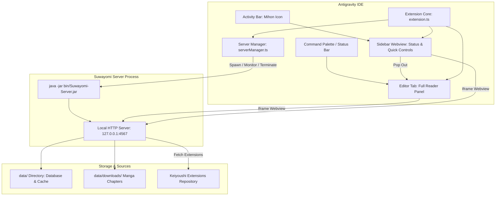

# feat: Antigravity IDE Mihon (Suwayomi) Integration

## Problem Frame
Reading manga while developing typically requires running external tools or managing a separate browser window pointing to a local or remote server. This context-switching disrupts developer workflow, requires manual background process management, and can leave unwanted Java processes running after work. We need a seamless, native-feeling Antigravity IDE integration that embeds Suwayomi (Mihon) directly into the IDE sidebar and editor tab, manages the background server lifecycle on demand, cleans up on IDE exit, and pre-configures sources for instant reading.

## Proposed Solution & Architecture
We will build a custom VS Code / Antigravity extension (`antigravity-mihon`) inside this workspace that:
1. **Packages and provisions** `Suwayomi-Server-v2.4.2366.jar` into `./bin/`, running on the user's verified system OpenJDK 17.
2. **Manages server lifecycle** via `ServerManager`: starts on-demand, binds to `127.0.0.1:4567` (with automatic port-collision resolution), monitors readiness via HTTP healthchecks, and kills the entire process tree cleanly on IDE deactivation.
3. **Embeds the reader** in two formats:
   - A dedicated **Activity Bar Sidebar View** for quick library navigation, server controls, and status.
   - A 1-click **Full-Scale Editor Webview Panel** (`Mihon: Open Full Reader`) for immersive, full-screen reading.
4. **Pre-configures Keiyoushi repository** so users have immediate access to hundreds of manga/manhwa sources.
5. **Compiles, packages into a `.vsix`**, and installs directly into Antigravity IDE via `antigravity-ide.cmd --install-extension`.

## High-Level Technical Design



## Output Structure

```
IDE Mihon/
├── bin/
│   └── Suwayomi-Server-v2.4.2366.jar      # Downloaded standalone server JAR
├── data/                                  # Suwayomi runtime data & library
│   └── downloads/                         # Downloaded manga chapters
├── docs/
│   ├── brainstorms/
│   │   └── 2026-10-02-ide-mihon-suwayomi-requirements.md
│   └── plans/
│       └── 2026-10-02-001-feat-antigravity-mihon-integration-plan.md
├── media/
│   ├── mihon.svg                          # Activity Bar & Status Bar icon
│   └── icon.png                           # Extension marketplace icon
├── src/
│   ├── extension.ts                       # Extension entrypoint & lifecycle hooks
│   ├── serverManager.ts                   # Child process spawner, port finder, healthcheck
│   ├── sidebarProvider.ts                 # WebviewViewProvider for left Activity Bar
│   ├── readerPanel.ts                     # Full-scale WebviewPanel for editor tab
│   ├── installer.ts                       # Binary download & verification utility
│   └── configManager.ts                   # Settings & Keiyoushi repo injector
├── package.json                           # Extension manifest, contributes, commands, settings
├── tsconfig.json                          # TypeScript compiler configuration
└── esbuild.js                             # Ultra-fast bundler script
```

## Key Technical Decisions
- **TypeScript + esbuild bundling**: Bundles the extension into a single lightweight `dist/extension.js` file for sub-millisecond startup times in Antigravity IDE.
- **Process Tree Cleanup with `tree-kill` & `taskkill`**: On Windows, child processes spawned by Node.js can easily become orphaned if only the parent is killed. We implement recursive process tree termination (`taskkill /F /T /PID`) during `deactivate()` to guarantee zero lingering processes.
- **Port Conflict Detection with `net.createServer`**: Before spawning Suwayomi, the extension probes port 4567. If in use, it dynamically finds the next free port (e.g. 4568) and passes `--server.port=<port>` to Suwayomi.
- **Webview Iframe with Security Policy**: Employs VS Code's `vscode-webview` sandbox with appropriate CSP to load `http://127.0.0.1:<port>` securely while allowing complete keyboard navigation and reading interaction.
- **Automated Binary Setup**: Includes a dedicated downloader script and fallback inside the extension that downloads the official GitHub release jar with progress reporting if missing.

---

## Implementation Units

### U1. Project Scaffolding & Extension Manifest
**Goal:** Initialize the Node.js TypeScript extension project structure, install dependencies, and define the extension manifest (`package.json`) with all necessary commands, views, configuration settings, and icons.
**Requirements:** R1, R4, R9, R10
**Files:**
- `package.json`
- `tsconfig.json`
- `esbuild.js`
- `media/mihon.svg`
**Approach:**
- Configure `package.json` with engine `vscode: ^1.85.0`.
- Register `viewsContainers.activitybar` with ID `mihon-sidebar`.
- Register `views.mihon-sidebar` view with ID `mihon.sidebarView` of type `webview`.
- Register commands: `mihon.openReader`, `mihon.startServer`, `mihon.stopServer`, `mihon.restartServer`, `mihon.configureStorage`.
- Define configuration schema: `mihon.serverPort`, `mihon.dataDirectory`, `mihon.downloadDirectory`, `mihon.autoStartServer`.
- Set up esbuild for high-speed compilation.
**Test Scenarios:**
- `npm run compile` produces `dist/extension.js` without errors.
- Schema validation succeeds for `package.json`.

### U2. Suwayomi Server Downloader & Pre-Configuration Utility
**Goal:** Implement the binary management module (`installer.ts`) to verify or download `Suwayomi-Server-v2.4.2366.jar` into `./bin/`, and configure the Keiyoushi extension repo.
**Requirements:** R8, R12
**Files:**
- `src/installer.ts`
- `src/configManager.ts`
**Approach:**
- Check for existing JAR in `./bin/Suwayomi-Server-v2.4.2366.jar`.
- If missing, download directly from GitHub release `https://github.com/Suwayomi/Suwayomi-Server/releases/download/v2.4.2366/Suwayomi-Server-v2.4.2366.jar` using Node HTTPS stream with a progress notification.
- In `configManager.ts`, ensure Suwayomi's configuration file or startup parameters inject the Keiyoushi repository URL: `https://raw.githubusercontent.com/keiyoushi/extensions/repo/index.min.json`.
**Test Scenarios:**
- If binary is absent, installer downloads the JAR and verifies file integrity and size (~182 MB).
- If binary exists, installer detects it immediately without re-downloading.

### U3. Server Lifecycle Manager & Healthcheck Engine
**Goal:** Implement `ServerManager` to handle child process execution, port probing, output logging, and clean termination.
**Requirements:** R5, R6, R7
**Files:**
- `src/serverManager.ts`
**Approach:**
- Implement `findAvailablePort(defaultPort: number): Promise<number>` using Node's `net` module.
- Spawn Java child process: `java -jar bin/Suwayomi-Server-v2.4.2366.jar --server.port=<port> --server.data-dir="<dataPath>"`.
- Create a dedicated OutputChannel (`Mihon Server`) to stream stdout and stderr logs for easy debugging.
- Implement an async healthcheck polling `http://127.0.0.1:<port>/api/v1/about` or root until server returns HTTP 200 (timeout: 45s).
- Implement `stopServer()`: send graceful shutdown, and fall back to Windows `taskkill /F /T /PID <pid>` to terminate all child threads.
**Test Scenarios:**
- Server starts successfully and healthcheck resolves to `true`.
- Invoking `stopServer()` terminates the Java process and frees the port.
- Port collision test: when 4567 is mocked/bound, server binds to 4568 smoothly.

### U4. Activity Bar Sidebar Webview & Controls
**Goal:** Implement the `SidebarProvider` webview view on the left Activity Bar to provide server state, quick action buttons, and an embedded preview.
**Requirements:** R1, R2, R11
**Files:**
- `src/sidebarProvider.ts`
**Approach:**
- Implement `vscode.WebviewViewProvider` with `resolveWebviewView`.
- Render a header bar with status badge (`RUNNING`, `STOPPED`, `STARTING`), action buttons (`Start`, `Stop`, `Open Full View`, `Settings`).
- When running, embed an iframe pointing to `http://127.0.0.1:<port>`.
- Wire messages between the webview and extension to handle button clicks (e.g. clicking "Open in Full Tab" triggers `mihon.openReader`).
**Test Scenarios:**
- Opening the left Activity Bar loads the Mihon view.
- Buttons trigger corresponding server actions and update UI state.

### U5. Full-Screen Editor Reader Panel & Status Bar Integration
**Goal:** Implement the full-scale editor Webview Panel (`ReaderPanel`) and Status Bar item for convenient one-click reading.
**Requirements:** R3, R4
**Files:**
- `src/readerPanel.ts`
- `src/extension.ts`
**Approach:**
- Create or reveal a `vscode.WebviewPanel` in `ViewColumn.One`.
- Configure `enableScripts: true` and `retainContextWhenHidden: true` so reading progress, scroll state, and active chapter are preserved when switching tabs.
- Register Status Bar item `📖 Mihon` with tooltip showing server status, port, and command `mihon.openReader`.
**Test Scenarios:**
- Executing `Mihon: Open Full Reader` opens a wide editor tab displaying the Suwayomi reader.
- Switching between code files and the Mihon tab maintains the current page without reloading.

### U6. Extension Packaging, Installation & End-to-End Verification
**Goal:** Package the extension into a `.vsix` file using `@vscode/vsce`, install it into Antigravity IDE, start the server, verify the sidebar and full reader, and confirm clean termination.
**Requirements:** All
**Files:**
- Output: `antigravity-mihon-0.1.0.vsix`
**Approach:**
- Run `npm run package` using `@vscode/vsce`.
- Execute `antigravity-ide.cmd --install-extension antigravity-mihon-0.1.0.vsix --force`.
- Launch server, confirm HTTP 200 on `http://127.0.0.1:4567`.
- Verify the sidebar loads the Suwayomi WebUI and Keiyoushi sources are present.
**Test Scenarios:**
- Extension shows as installed in `antigravity-ide.cmd --list-extensions`.
- Server launches and shuts down cleanly without leaving background processes.

---

## System-Wide Impact
- **Performance:** When stopped, 0% CPU and 0 MB RAM overhead. When active, Suwayomi uses approximately 150-250 MB RAM (standard Java server footprint).
- **Security:** Server binds exclusively to loopback (`127.0.0.1`), inaccessible to external network interfaces.
- **Portability:** Everything is contained inside `./bin` and the user-specified `./data` directory.

## Verification Plan
### Automated Verification
1. `npm run compile`: Ensure TypeScript builds without warnings or errors.
2. `npx @vscode/vsce package`: Ensure clean packaging into `.vsix`.
3. Standalone launch test: Run server healthcheck script to verify Java 17 execution and port readiness.

### Manual Verification
1. Click the **Mihon** icon in Antigravity's left Activity Bar.
2. Verify server starts and status switches to **Running**.
3. Click **Open in Editor Tab** to test full-scale reading view.
4. Go to **Browse -> Extensions** in the WebUI to verify Keiyoushi extensions list loads.
5. Close Antigravity and check Windows Task Manager to confirm Java process has terminated cleanly.
