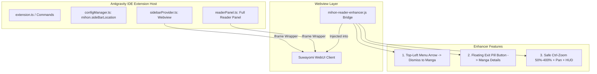

# Technical Plan: Reader Navigation Flow, Dual Sidebar Placement, and Safe Ctrl-Zoom

## Summary
Implements three high-impact usability enhancements for the Antigravity IDE Mihon extension:
1. **Reader Navigation Flow**: Repurposes the reader menu backward arrow to return directly to the active manga page, while introducing a floating translucent exit button on the manga canvas to return to Manga Details or Library.
2. **Dual Sidebar Placement (Left vs Right)**: Enables placing the Mihon sidebar in either the primary Activity Bar (left) or the Secondary Side Bar (`auxiliarybar` on the right), allowing developers to keep code/explorer on the left and Mihon on the right simultaneously, with a 1-click toolbar toggle and configuration setting.
3. **Safe Manga Ctrl-Zoom**: Adds smooth `Ctrl + Mouse Wheel` and `Ctrl +/-/0` image zoom clamped between 50% and 400%, with click-and-drag pan when zoomed in, auto-reset on page turns, zero interference with IDE zoom, and zero accidental triggers.

---

## Requirements Traceability

| ID | Title | Implementation Unit | Description |
|---|---|---|---|
| R20 | Reader Menu Dismissal via Back Arrow | U1 | Top-left arrow in reader menu dismisses controls and returns to manga view. |
| R21 | Floating Exit Button on Manga Reading Screen | U1 | Translucent floating pill button (35% idle opacity, 100% on hover) in top-left corner. |
| R22 | Exit Navigation Target | U1 | Floating button navigates to `/manga/:mangaId` (chapters list), fallback to `/`. |
| R23 | Multi-View Consistency | U1, U3 | Navigation and zoom enhancements operate in both Sidebar View and Full Reader Tab. |
| R24 | Visual Polish & Zero Emojis | U1, U2 | Uses codicons / SVG icons conforming to Antigravity design guidelines. |
| R25 | Dual Sidebar Placement (Left / Right) | U2 | Registers views container in both Activity Bar and Auxiliary Bar with 1-click toggle and setting. |
| R26 | Safe Clamped Manga Ctrl-Zoom | U3 | `Ctrl + Wheel` / keyboard zoom (50%-400%) with drag-pan, no IDE zoom leak, auto-reset on page change. |
| R27 | Dedicated Brand Identity (MangaBar) | U0 | Official rebranding to 'MangaBar - Manga & Comic Reader' with SEO metadata and Mihon/Suwayomi alternative keywords. |

---

## High-Level Technical Design

---

## Key Technical Decisions & Rationale

### 1. Client-Side Script Injection Bridge (`mihon-reader-enhancer.js`)
- **Decision:** Inject a lightweight client script into the Suwayomi reader page context.
- **Rationale:** Suwayomi WebUI runs inside an iframe. Running inside the iframe window allows native DOM observation, event interception (stopping default navigation on menu back arrow), rendering the floating exit button directly over the reader canvas, and capturing `wheel` events with `e.preventDefault()` to prevent zooming the entire outer IDE.
- **Alternative Considered:** Outer webview overlay. Rejected because outer webview overlays cannot track scroll position or reader state changes happening inside the iframe.

### 2. Dual ViewsContainer Contribution (`activitybar` + `auxiliarybar`)
- **Decision:** Declare view containers in `package.json` for both `activitybar` (left) and `auxiliarybar` (right), or use VS Code's `workbench.action.moveFocusedView` / `workbench.action.toggleSecondarySideBar` command integration alongside a setting `mihon.sideBarLocation: "left" | "right"`.
- **Rationale:** `auxiliarybar` is the standard VS Code mechanism for secondary sidebars (right side). This enables a true split view: code on the left, manga on the right.

### 3. Zoom Safety Guardrails
- **Decision:**
  1. Only trigger zoom when `e.ctrlKey || e.metaKey` is true; regular scrolling is untouched.
  2. Call `e.preventDefault()` and `e.stopPropagation()` on `wheel` when Ctrl is held to stop Chromium from zooming the entire IDE window.
  3. Clamp zoom scale strictly between `0.5x` (50%) and `4.0x` (400%).
  4. Only enable drag-to-pan when `scale > 1.0x`; at `1.0x`, page turn click zones (Previous, Menu, Next) remain 100% active.
  5. Auto-reset zoom to `1.0x` when the page changes or a new chapter is opened.

---

## Implementation Units

### U1. Reader Navigation Enhancer Script (`src/readerEnhancer.ts`)
- **Goal:** Build the client-side enhancer script that fixes menu back arrow behavior and adds the floating exit button.
- **Requirements:** R20, R21, R22, R24.
- **Files:**
  - `src/readerEnhancer.ts` (new)
  - `src/sidebarProvider.ts`
  - `src/readerPanel.ts`
- **Approach:**
  - Detect reader routes (`/manga/:id/chapter/:order`).
  - Intercept click on the top-left backward arrow in the reader menu: instead of navigating out, trigger menu dismissal (e.g. click middle zone or dispatch Escape).
  - Inject floating exit button in top-left corner:
    - Circular pill with backdrop blur: `rgba(24, 24, 28, 0.7)`, border `1px solid rgba(255, 255, 255, 0.15)`.
    - 35% opacity idle; 100% on hover/touch.
    - SVG Codicon arrow icon (`<svg viewBox="0 0 16 16"><path d="M7.78 12.53a.75.75 0 0 1-1.06 0L2.47 8.28a.75.75 0 0 1 0-1.06l4.25-4.25a.75.75 0 0 1 1.06 1.06L4.31 7.5h8.94a.75.75 0 0 1 0 1.5H4.31l3.47 3.47a.75.75 0 0 1 0 1.06z"/></svg>`).
    - On click: navigates out to `/manga/${mangaId}` (or browser history back).
- **Test Scenarios:**
  - Open a chapter. Verify the floating exit button is visible in the top-left corner.
  - Hover over the button: verify opacity smoothly transitions from 0.35 to 1.0.
  - Click the floating button: verify it navigates back to the Manga Details page.
  - Open reader menu (tap center): click the menu's top-left back arrow; verify it dismisses the menu and keeps the manga view open.

---

### U2. Dual Sidebar Placement (Left vs Right)
- **Goal:** Enable user to position Mihon on either the Left Primary Side Bar or the Right Secondary Side Bar (`auxiliarybar`).
- **Requirements:** R25.
- **Files:**
  - `package.json`
  - `src/configManager.ts`
  - `src/extension.ts`
  - `src/sidebarProvider.ts`
- **Approach:**
  - Add setting `mihon.sideBarLocation` with enum `["left", "right"]`, default `"left"`.
  - Add command `mihon.toggleSideBarLocation` ("Mihon: Toggle Side Bar Location (Left / Right)").
  - In `sidebarProvider.ts` header bar: add a 1-click icon button (`Move to Right Side` / `Move to Left Side`) using a layout split SVG icon.
  - When clicked: updates configuration and executes native `workbench.action.moveFocusedView` or focuses the appropriate view container in the secondary side bar.
- **Test Scenarios:**
  - Click "Move to Right" in Mihon header: verify Mihon moves to the right auxiliary bar.
  - Verify File Explorer remains open and operational on the left while reading manga on the right.
  - Click "Move to Left": verify Mihon moves back to the primary left activity bar.
  - Change `mihon.sideBarLocation` in VS Code Settings: verify position persists across IDE restarts.

---

### U3. Safe Manga Canvas Ctrl-Zoom (`src/readerZoom.ts`)
- **Goal:** Implement smooth, safe Ctrl-wheel and keyboard zoom with pan and auto-reset.
- **Requirements:** R26.
- **Files:**
  - `src/readerZoom.ts` (new)
  - `src/readerEnhancer.ts`
- **Approach:**
  - Listen for `wheel` events on reader image container:
    - If `e.ctrlKey || e.metaKey`:
      - `e.preventDefault()`, `e.stopPropagation()`.
      - Adjust zoom scale: `scale += (e.deltaY < 0 ? 0.15 : -0.15)`.
      - Clamp between `0.5` and `4.0`.
  - Listen for `keydown` events:
    - `Ctrl + =` or `Ctrl + +`: zoom in by 0.25x.
    - `Ctrl + -`: zoom out by 0.25x.
    - `Ctrl + 0`: reset zoom to 1.0x.
  - When `scale > 1.0x`:
    - Enable mouse drag-to-pan (`mousedown` + `mousemove` + `mouseup`).
    - Adjust CSS `transform: translate(x, y) scale(s)`.
  - When `scale === 1.0x`:
    - Reset transforms; standard click-to-turn touch zones function normally.
  - Transient HUD:
    - Display a small pill: `150% [Reset]`.
    - Auto-fades after 1.5 seconds of inactivity.
  - Page Change Detection:
    - Listen for page index updates or DOM image replacement: immediately reset scale to `1.0x`.
- **Test Scenarios:**
  - Hold Ctrl and scroll mouse wheel up on a manga page: verify image zooms in smoothly without scaling the outer IDE window.
  - Scroll down: verify image zooms out down to 50% minimum.
  - At 150% zoom, drag with mouse: verify image pans smoothly to read panels.
  - At 100% zoom, click left/right zones: verify pages turn normally without accidental dragging.
  - Press `Ctrl + 0`: verify zoom resets instantly to 100%.
  - Turn to next page: verify zoom auto-resets so the new page starts properly fitted.

---

### U5. Dedicated 'Reload View' vs Safe 'Restart Server' Architecture
- **Goal:** Provide two distinct, intuitive actions: an instant `<100ms` Webview reload (`$(refresh)`), and a safe, lock-cleared backend server restart (`$(sync)`) that eliminates "exit code 1: Process exited prematurely".
- **Requirements:** R28, R29.
- **Files:**
  - `package.json`
  - `src/serverManager.ts`
  - `src/sidebarProvider.ts`
  - `src/readerPanel.ts`
  - `src/extension.ts`
- **Approach:**
  - **`package.json`**:
    - Register command `mihon.reloadView` ("Reload View", icon `$(refresh)`).
    - Update `mihon.restartServer` icon to `$(sync)`.
    - In `menus["view/title"]`:
      - Group 1: `mihon.reloadView` (`$(refresh)`, group: `navigation@1`)
      - Group 2: `mihon.restartServer` (`$(sync)`, group: `navigation@2`)
      - Group 3: `mihon.toggleSideBarLocation` (`$(split-horizontal)`, group: `navigation@0`)
      - Group 4: `mihon.openReader` (`$(expand-all)`, group: `navigation@3`)
  - **`serverManager.ts`**:
    - Enhance `stopServer()`:
      - Terminate child process.
      - Poll PID until process is confirmed dead.
      - Await TCP port `4567` release.
    - Implement `restartServer()`:
      - Show progress notification: "Restarting MangaBar server...".
      - Gracefully and forcibly terminate old process.
      - Wait 1.5s - 2.0s for H2 database lock file (`server.mv.db`) and Windows socket to be released.
      - Double-check port availability; if still busy, clean zombie PID and retry.
      - Start server with clean environment and error recovery.
  - **`sidebarProvider.ts` & `readerPanel.ts`**:
    - Add `reloadView()` method that posts message `{ type: 'reload' }` to webview.
    - In HTML header toolbar: Add distinct "Reload Page" (`$(refresh)`) button and "Restart Server" (`$(sync)`) button.
    - In webview script: On `{ type: 'reload' }`, reload `iframe.src` without destroying webview container.
- **Test Scenarios:**
  - Click `$(refresh)` (Reload View): WebUI page refreshes in <100ms; background Java process continues running without interruption.
  - Click `$(sync)` (Restart Server): Java process stops cleanly, file/port locks release, server boots up cleanly with 0 premature exit errors.
  - In Error state: Clicking "Retry Start" or "Restart Server" successfully kills lingering zombie processes and starts cleanly.

---

## Risk Analysis & Mitigations

| Risk | Impact | Mitigation |
|---|---|---|
| Cross-origin iframe event blocking | Injected scripts cannot attach to iframe DOM if origins differ. | Proxy or serve via extension local server bridge where enhancer script is bundled directly into the HTML response. |
| Zoom hijacking regular scrolling | User trying to scroll vertically accidentally zooms image. | Strictly require `e.ctrlKey === true` before intercepting wheel events. Normal wheel scroll remains 100% native. |
| IDE window zooming instead of manga | Browser default zooms entire Antigravity window. | Execute `e.preventDefault()` and `e.stopImmediatePropagation()` on every Ctrl+wheel and Ctrl+keyboard event. |
| Secondary side bar availability | Older VS Code engines may handle Auxiliary Bar differently. | Provide fallback that uses `workbench.action.toggleSidebarPosition` if `auxiliarybar` is not activated. |
